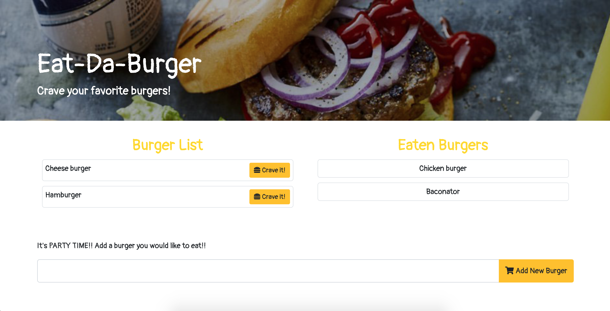

# Node Express Handlebars

### Heroku URL:
https://warm-island-93846.herokuapp.com/

### Screenshot:

## Table of Contents
    
* [Overview](#overview)
    
* [Description](#description)
    
* [Usage](#usage)
    
* [License](#license)

## Overview

In this assignment, a burger logger was created with MySQL, Node, Express, Handlebars and a homemade ORM (yum!). The MVC design pattern was followed; Node and MySQL was used to query and route data in the app, and Handlebars to generate HTML.

## Description

* Eat-Da-Burger! is a restaurant app that lets users input the names of burgers they'd like to eat.

* Whenever a user submits a burger's name, your app will display the burger on the left side of the page -- waiting to be devoured.

* Each burger in the waiting area also has a `Crave it!` button. When the user clicks it, the burger will move to the right side of the page.

* The app will store every burger in a database, whether devoured or not.

## Usage
Inside the folder name "db" there are schema.sql and seeds.sql. You must run those files to create database.
Start the application by typing "node server.js". You will need to install mysql, express, express-handlebars, and dotenv to run this application.

## License
    
* MIT license

* Copyright 2020 © Haley Jeon

* This project was created and licensed under Haley Jeon. You may not use this file except in compliance with the License. All permission to this project is under @tndus604. See the github: https://github.com/tndus604
